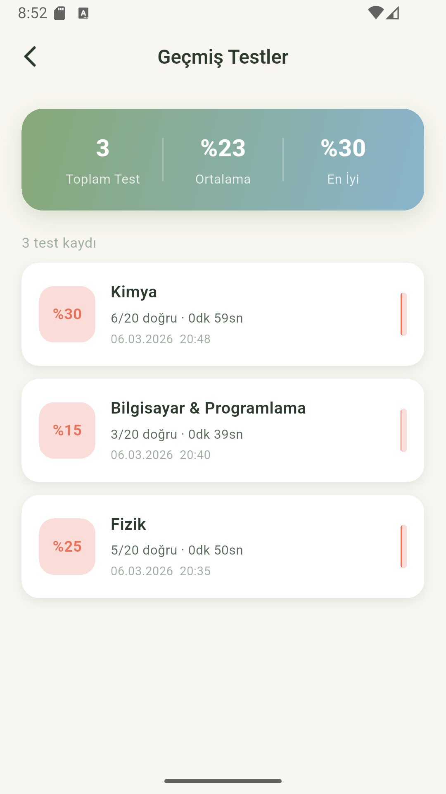
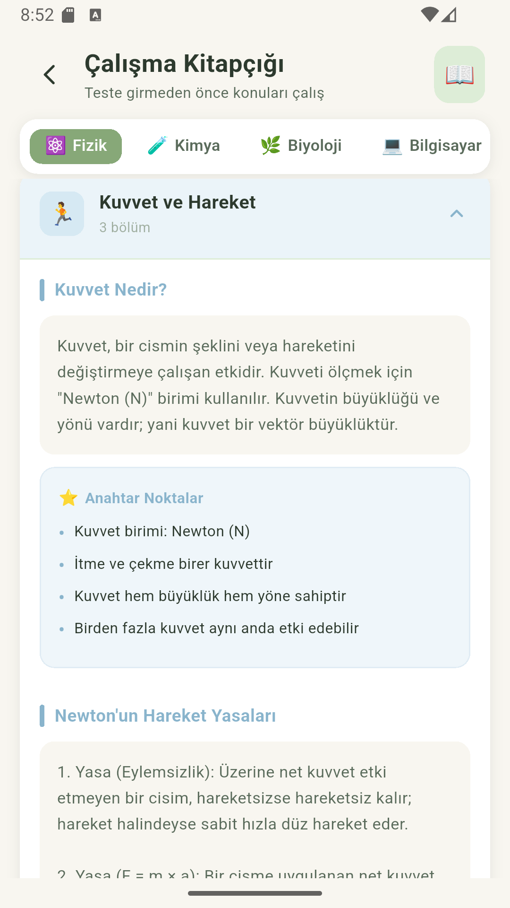

<div align="center">

# ✦ LUMINA QUIZ
### AI Destekli Eğitim Uygulaması

[](https://flutter.dev)
[](https://dart.dev)
[](https://ai.google.dev)
[](https://www.sqlite.org)
[](LICENSE)

*Ortaokul öğrencileri için Gemini AI destekli, kişiselleştirilmiş quiz deneyimi*

</div>

---

## 📱 Ekran Görüntüleri

<div align="center">
<table>
  <tr>
    <td align="center">
      
      <br/><b>Ana Sayfa & Kategoriler</b>
    </td>
    <td align="center">
      
      <br/><b>Quiz & AI Mentor Sonucu</b>
    </td>
  </tr>
</table>
</div>

---

## 🎬 Demo Video

<div align="center">

<video src="images/video.mp4" controls width="320" style="border-radius:16px">
  <a href="images/video.mp4">
    
  </a>
</video>

> *Video oynatılmıyorsa [buraya tıkla](images/video.mp4)*

</div>

---

## 🌟 Özellikler

### 🎯 Quiz Sistemi
- **5 Kategori:** Fizik · Kimya · Biyoloji · Bilgisayar & Programlama · İngilizce
- **20 Soru** her testte — Gemini AI tarafından dinamik olarak üretilir
- **3 Zorluk Seviyesi:** Kolay (5 dk) · Orta (10 dk) · Zor (14 dk)
- Ortaokul müfredatına uygun (MEB 5-8. sınıf)

### 🤖 AI Mentor
- Test sonunda Gemini 2.5 Flash ile kişisel analiz
- Yanlış soruların nedenleri teşvik edici dille açıklanır
- Performansa göre özelleştirilmiş tavsiyeler

### 📖 Çalışma Kitapçığı
- AI kullanmadan, hazır yazılmış ders notları
- Tüm kategoriler için konu özetleri ve anahtar noktalar
- Teste girmeden önce çalışma imkânı

### 📊 Skor Takibi
- SQLite ile tüm test geçmişi kaydedilir
- Kategori bazlı başarı oranı istatistikleri
- Swipe ile geçmiş test silme

### ✨ Kullanıcı Deneyimi
- Pastel renk paleti (Sage Green · Soft Blue · Pale Yellow)
- Doğru cevap: 💚 yumuşak yeşil parlama + hafif titreşim
- Yanlış cevap: ❤️ kırmızı uyarı + ekran sarsılma animasyonu
- Cihaz ID ile sessiz kayıt & karşılama animasyonu
- Yumuşak sayfa geçişleri

---

## 🛠️ Teknoloji Yığını

| Katman | Teknoloji |
|--------|-----------|
| **Framework** | Flutter 3.x |
| **Dil** | Dart 3.x |
| **AI** | Google Gemini 2.5 Flash (REST API v1beta) |
| **Veritabanı** | SQLite (`sqflite`) |
| **HTTP** | `http` paketi |
| **Cihaz Bilgisi** | `device_info_plus` |
| **Yerel Depolama** | `shared_preferences` |

---

## 📁 Proje Yapısı

```
lib/
├── main.dart
├── theme/
│   └── app_theme.dart          # Renk paleti & tema
├── models/
│   ├── question_model.dart     # Quiz sorusu & kategoriler
│   ├── quiz_session_model.dart # Oturum & hata modelleri
│   └── difficulty_model.dart  # Zorluk seviyeleri
├── services/
│   ├── gemini_service.dart     # Gemini API entegrasyonu
│   └── database_service.dart  # SQLite CRUD işlemleri
├── data/
│   └── study_content.dart     # Hazır ders notları
└── views/
    ├── splash_screen.dart      # Açılış & cihaz kaydı
    ├── home_page.dart          # Ana sayfa & kategoriler
    ├── difficulty_sheet.dart   # Zorluk seçimi
    ├── quiz_page.dart          # Quiz ekranı
    ├── result_page.dart        # Sonuç & AI analizi
    ├── study_page.dart         # Çalışma kitapçığı
    └── history_page.dart       # Geçmiş testler
```

---

## 🚀 Kurulum

### Gereksinimler
- Flutter SDK `>=3.0.0`
- Dart SDK `>=3.0.0`
- Android SDK veya iOS Simulator
- Google Gemini API anahtarı

### 1. Repoyu Klonla
```bash
git clone https://github.com/kullaniciadi/lumina-quiz.git
cd lumina-quiz
```

### 2. Bağımlılıkları Yükle
```bash
flutter pub get
```

### 3. API Anahtarını Ayarla

`lib/services/gemini_service.dart` dosyasını aç ve API anahtarını gir:

```dart
static const String _apiKey = 'BURAYA_API_ANAHTARINI_YAZ';
```

> ⚠️ **Güvenlik Notu:** Prodüksiyon ortamında API anahtarını environment variable olarak saklayın.

### 4. Gemini API Kurulumu

1. [Google AI Studio](https://aistudio.google.com/app/apikey) adresine git
2. Yeni bir API anahtarı oluştur
3. [Google Cloud Console](https://console.cloud.google.com) üzerinden **billing** hesabını aktifleştir
4. **Generative Language API**'yi etkinleştir

### 5. Uygulamayı Çalıştır
```bash
flutter run
```

---

## 🔑 Gemini API Konfigürasyonu

Uygulama **Google Gemini 2.5 Flash** modelini kullanır:

- **Endpoint:** `https://generativelanguage.googleapis.com/v1beta/models/gemini-2.5-flash-preview-04-17:generateContent`
- **Ücretsiz Katman:** 15 istek/dakika · 1.500 istek/gün
- **Sistem Prompt:** Ortaokul MEB müfredatına uygun soru üretimi + AI mentor analizi

---

## 🗄️ Veritabanı Şeması

```sql
CREATE TABLE QuizSessions (
    id               INTEGER PRIMARY KEY AUTOINCREMENT,
    category         TEXT    NOT NULL,
    score            INTEGER NOT NULL,
    total_questions  INTEGER NOT NULL DEFAULT 20,
    date             DATETIME NOT NULL,
    duration_seconds INTEGER NOT NULL DEFAULT 0
);

CREATE TABLE Mistakes (
    id            INTEGER PRIMARY KEY AUTOINCREMENT,
    session_id    INTEGER NOT NULL,
    question      TEXT    NOT NULL,
    user_choice   TEXT    NOT NULL,
    correct_answer TEXT   NOT NULL,
    hint          TEXT    DEFAULT '',
    FOREIGN KEY (session_id) REFERENCES QuizSessions(id)
);
```

---

## 📋 Quiz Akışı

```
Açılış Animasyonu (Cihaz Kaydı)
        ↓
   Ana Sayfa
   ├── 📖 Çalışma Kitapçığı  →  Ders Notları
   └── Kategori Seç
              ↓
     Zorluk Seviyesi Seç
     (Kolay / Orta / Zor)
              ↓
    AI Soru Üretimi (Gemini)
              ↓
       Quiz (20 Soru)
       ├── ✅ Doğru → Yeşil parlama + titreşim
       └── ❌ Yanlış → Kırmızı + sarsılma
              ↓
      Sonuç & AI Mentor Analizi
              ↓
      Geçmişe Kaydet (SQLite)
```

---

## 🤝 Katkıda Bulunma

1. Repoyu fork'la
2. Feature branch oluştur (`git checkout -b feature/yeni-ozellik`)
3. Değişikliklerini commit'le (`git commit -m 'feat: yeni özellik eklendi'`)
4. Branch'ini push'la (`git push origin feature/yeni-ozellik`)
5. Pull Request aç

---

## 📄 Lisans

Bu proje [MIT Lisansı](LICENSE) altında lisanslanmıştır.

---

<div align="center">

**HAYEF Öğrenme Fuarı 2026** için geliştirilmiştir

</div>
