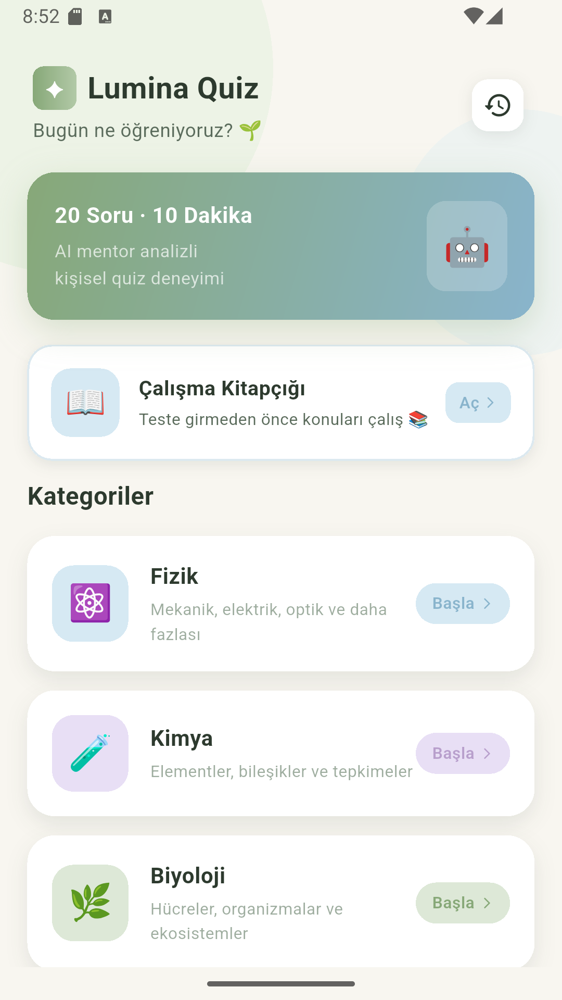

<div align="center">

# 📖 LUMINA QUIZ
### AI Destekli Eğitim Uygulaması

*Ortaokul öğrencileri için Gemini AI destekli, kişiselleştirilmiş quiz deneyimi*

</div>

---

## 📱 Ekran Görüntüleri

<div align="center">
<table>
  <tr>
    <td align="center">
      
      <br/><b>Ana Sayfa & Kategoriler</b>
    </td>
    <td align="center">
      
      <br/><b>Quiz & AI Mentor Sonucu</b>
    </td>
    <td align="center">
      
      <br/><b>Kitapçık & Tekrar Konuları</b>
    </td>
  </tr>
</table>
</div>

---

## 🎬 Demo Video

<div align="center">

<video src="images/video.mp4" controls width="320" style="border-radius:16px">
  <a href="images/video.mp4">
    
  </a>
</video>

> *Video oynatılmıyorsa [buraya tıkla](images/video.mp4)*

</div>

---

## 🌟 Özellikler

### 🎯 Quiz Sistemi
- **8 Kategori:** Fizik · Kimya · Biyoloji · Bilgisayar & Programlama · İngilizce · Matematik · Türkçe · Tarih
- **20 Soru** her testte — Gemini AI tarafından dinamik olarak üretilir
- **3 Zorluk Seviyesi:** Kolay (5 dk) · Orta (10 dk) · Zor (14 dk)
- Ortaokul müfredatına uygun (MEB 5-8. sınıf)
- **⏸️ Test Duraklatma** — Testi istediğin zaman duraklat ve devam et
- **✅ Soru Validasyonu** — AI çıktısı otomatik doğrulanır, hatalı sorular filtrelenir

### 🤖 AI Mentor
- Test sonunda Gemini 2.5 Flash ile kişisel analiz
- Yanlış soruların nedenleri teşvik edici dille açıklanır
- Performansa göre özelleştirilmiş tavsiyeler

### 🎯 Günlük Görev
- Her gün 5 soruluk mini test
- Ekstra XP kazanma fırsatı
- Konu bazlı seçim (Fen, Bilgisayar, Karma)

### 🃏 Flashcard Modu
- Çalışma notlarından otomatik üretilen flip kartlar
- Dokunarak kartı çevir, kaydırarak ilerle
- Kategori bazlı kart setleri

### 🏆 Gamification Sistemi
- **XP Sistemi:** Her doğru cevap XP kazandırır (zorluk çarpanıyla)
- **6 Seviye:** Aday → Öğrenci → Keşifçi → Bilge → Usta → Efsane
- **27 Rozet:** İlk test, tam puan, seri, kategori, tüm kategoriler ve daha fazlası
- **Günlük Seri:** Art arda günler test çözerek seri oluştur

### 👤 Profil Sayfası
- XP çubuğu, seviye ve günlük seri gösterimi
- **Rozetler** — Kazanılmış / kilitli tüm rozetler
- **Gelişim Grafiği** — Kategori bazlı başarı çubukları
- **Test Geçmişi** — Tüm geçmiş testler ve yanlışlar
- **Karanlık Mod** toggle

### 📖 Çalışma Kitapçığı
- AI kullanmadan, hazır yazılmış ders notları
- Tüm kategoriler için konu özetleri ve anahtar noktalar
- Teste girmeden önce çalışma imkânı

### ✨ Kullanıcı Deneyimi
- 🌙 **Karanlık Mod** desteği
- Pastel renk paleti (Sage Green · Soft Blue · Pale Yellow)
- Doğru cevap: 💚 yumuşak yeşil parlama + hafif titreşim
- Yanlış cevap: ❤️ kırmızı uyarı + ekran sarsılma animasyonu
- **Sonuç Paylaşma** — Test sonucunu arkadaşlarınla paylaş
- Alt navigasyon çubuğu (Ana Sayfa / Profil)
- Yumuşak sayfa geçişleri

---

## 🛠️ Teknoloji Yığını

| Katman | Teknoloji |
|--------|-----------|
| **Framework** | Flutter 3.x |
| **Dil** | Dart 3.x |
| **AI** | Google Gemini 2.5 Flash (REST API v1beta) |
| **Veritabanı** | SQLite (`sqflite`) |
| **HTTP** | `http` paketi |
| **Paylaşım** | `share_plus` |
| **Cihaz Bilgisi** | `device_info_plus` |
| **Yerel Depolama** | `shared_preferences` |

---

## 📁 Proje Yapısı

```
lib/
├── main.dart                       # Giriş noktası, bottom nav, theme mode
├── theme/
│   └── app_theme.dart              # Renk paleti, light & dark tema
├── models/
│   ├── question_model.dart         # Quiz sorusu & kategoriler
│   ├── quiz_session_model.dart     # Oturum & hata modelleri
│   ├── difficulty_model.dart       # Zorluk seviyeleri
│   └── gamification_model.dart    # XP, rozet, seviye sistemi
├── services/
│   ├── gemini_service.dart         # Gemini API entegrasyonu
│   ├── database_service.dart       # SQLite CRUD işlemleri
│   └── gamification_service.dart  # XP hesaplama, rozet verme
├── data/
│   └── study_content.dart         # Hazır ders notları
└── views/
    ├── splash_screen.dart          # Açılış & cihaz kaydı
    ├── home_page.dart              # Ana sayfa & günlük görev
    ├── profile_page.dart           # Profil & ayarlar
    ├── profile/
    │   ├── badge_page.dart         # Rozet koleksiyonu
    │   └── chart_page.dart         # Gelişim grafiği
    ├── difficulty_sheet.dart       # Zorluk seçimi
    ├── quiz_page.dart              # Quiz ekranı (duraklatma destekli)
    ├── result_page.dart            # Sonuç, XP, AI analizi, paylaşım
    ├── flashcard_page.dart         # Flip kart çalışma modu
    ├── daily_challenge_page.dart   # Günlük 5 soruluk görev
    ├── study_page.dart             # Çalışma kitapçığı
    └── history_page.dart          # Geçmiş testler
```

---

## 🗄️ Veritabanı Şeması

```sql
CREATE TABLE QuizSessions (
    id               INTEGER PRIMARY KEY AUTOINCREMENT,
    category         TEXT    NOT NULL,
    score            INTEGER NOT NULL,
    total_questions  INTEGER NOT NULL DEFAULT 20,
    date             DATETIME NOT NULL,
    duration_seconds INTEGER NOT NULL DEFAULT 0
);

CREATE TABLE Mistakes (
    id             INTEGER PRIMARY KEY AUTOINCREMENT,
    session_id     INTEGER NOT NULL,
    question       TEXT    NOT NULL,
    user_choice    TEXT    NOT NULL,
    correct_answer TEXT    NOT NULL,
    hint           TEXT    DEFAULT '',
    FOREIGN KEY (session_id) REFERENCES QuizSessions(id)
);

CREATE TABLE UserProfile (
    id                   INTEGER PRIMARY KEY DEFAULT 1,
    total_xp             INTEGER NOT NULL DEFAULT 0,
    streak_days          INTEGER NOT NULL DEFAULT 0,
    last_quiz_date       TEXT,
    last_challenge_date  TEXT
);

CREATE TABLE AwardedBadges (
    badge_id   TEXT PRIMARY KEY,
    awarded_at TEXT NOT NULL
);
```

---

## 🎮 Seviye ve Rozet Sistemi

### ⭐ XP Kazanma

Her doğru cevap XP kazandırır. Zorluk seviyesi çarpan etkisi yapar:

| Zorluk | XP / Doğru | Maks. XP (20 soru) |
|--------|-----------|---------------------|
| Kolay  | 7 XP      | 140 XP              |
| Orta   | 10 XP     | 200 XP              |
| Zor    | 15 XP     | 300 XP              |

### 🎓 Seviye Sıralaması

| Seviye | Unvan      | Gerekli XP |
|--------|------------|------------|
| 1      | Aday       | 0 XP       |
| 2      | Öğrenci    | 100 XP     |
| 3      | Keşifçi    | 300 XP     |
| 4      | Bilge      | 600 XP     |
| 5      | Usta       | 1.000 XP   |
| 6      | Efsane     | 2.000 XP   |

### 🏆 Rozet Koleksiyonu (27 Rozet)

**Başlangıç**

| Rozet | Koşul |
|-------|-------|
| 🌱 İlk Adım | İlk testi tamamla |
| 📖 Araştırmacı | Çalışma kitapçığını aç |
| 🃏 Kart Ustası | Flashcard modunu aç |

**Başarı**

| Rozet | Koşul |
|-------|-------|
| 💯 Tam Puan | Bir testte 20/20 al |
| 🔥 Zorluk Avcısı | Zor seviyede test tamamla |
| 😊 Kolay Başlangıç | Kolay seviyede %100 al |
| ⚡ Hız Şampiyonu | 5 dakikadan kısa sürede testi bitir |

**Günlük Seri**

| Rozet | Koşul |
|-------|-------|
| 🌤️ 3 Gün Serisi | 3 gün art arda test çöz |
| 🔆 7 Gün Serisi | 7 gün art arda test çöz |
| 🌟 14 Gün Serisi | 14 gün art arda test çöz |

**Günlük Görev**

| Rozet | Koşul |
|-------|-------|
| 🎯 Günlük Kahraman | İlk günlük görevi tamamla |
| 🏅 7 Günlük Görev | 7 günlük görevi tamamla |

**Doğru & Test Sayısı**

| Rozet | Koşul |
|-------|-------|
| 💪 100 Doğru | Toplamda 100 doğru cevap |
| 🏆 500 Doğru | Toplamda 500 doğru cevap |
| 👑 1000 Doğru | Toplamda 1000 doğru cevap |
| 📚 10 Test | Toplamda 10 test tamamla |
| 🎓 25 Test | Toplamda 25 test tamamla |

**Kategori Uzmanları**

| Rozet | Koşul |
|-------|-------|
| ⚛️ Fizik Meraklısı | Fizik'te 3 test |
| 🧪 Kimya Öğrencisi | Kimya'da 3 test |
| 🌿 Biyolog | Biyoloji'de 3 test |
| 💻 Kodcu | Bilgisayar'da 3 test |
| 🇬🇧 İngilizce Tutkunu | İngilizce'de 3 test |
| 📐 Matematikçi | Matematik'te 3 test |
| 📝 Türkçe Ustası | Türkçe'de 3 test |
| 🏛️ Tarihçi | Tarih'te 3 test |

**Özel**

| Rozet | Koşul |
|-------|-------|
| 🌍 Çok Yönlü | Tüm kategorilerde en az 1 test |
| 🦉 Gece Kuşu | Gece 22:00'den sonra test tamamla |

---

## 🚀 Kurulum

### Gereksinimler
- Flutter SDK `>=3.0.0`
- Dart SDK `>=3.0.0`
- Android SDK veya iOS Simulator
- Google Gemini API anahtarı

### 1. Repoyu Klonla
```bash
git clone https://github.com/kullaniciadi/lumina-quiz.git
cd lumina-quiz
```

### 2. Bağımlılıkları Yükle
```bash
flutter pub get
```

### 3. API Anahtarını Ayarla

`lib/services/gemini_service.dart` dosyasını aç ve API anahtarını gir:

```dart
static const String _apiKey = 'BURAYA_API_ANAHTARINI_YAZ';
```

> ⚠️ **Güvenlik Notu:** Prodüksiyon ortamında API anahtarını environment variable olarak saklayın.

### 4. Gemini API Kurulumu

1. [Google AI Studio](https://aistudio.google.com/app/apikey) adresine git
2. Yeni bir API anahtarı oluştur
3. [Google Cloud Console](https://console.cloud.google.com) üzerinden **billing** hesabını aktifleştir
4. **Generative Language API**'yi etkinleştir

### 5. Uygulamayı Çalıştır
```bash
flutter run
```

---

## 🔑 Gemini API Konfigürasyonu

Uygulama **Google Gemini 2.5 Flash** modelini kullanır:

- **Endpoint:** `https://generativelanguage.googleapis.com/v1beta/models/gemini-2.5-flash-preview-04-17:generateContent`
- **Ücretsiz Katman:** 15 istek/dakika · 1.500 istek/gün
- **Sistem Prompt:** Ortaokul MEB müfredatına uygun soru üretimi + AI mentor analizi

---

## 📋 Quiz Akışı

```
Açılış Animasyonu (Cihaz Kaydı)
        ↓
   Ana Sayfa (Bottom Nav: Ana / Profil)
   ├── 🎯 Günlük Görev (5 soru, XP bonus)
   ├── 📖 Çalışma Kitapçığı  →  Ders Notları
   └── Kategori Seç
              ↓
     Zorluk Seviyesi Seç
     (Kolay / Orta / Zor)
              ↓
    AI Soru Üretimi + Validasyon (Gemini)
              ↓
       Quiz (20 Soru) + Duraklatma
       ├── ✅ Doğru → Yeşil parlama + titreşim
       └── ❌ Yanlış → Kırmızı + sarsılma
              ↓
      Sonuç & AI Mentor Analizi
      ├── ⭐ XP Kazanıldı
      ├── 🏆 Yeni Rozet (varsa)
      └── 📤 Paylaş
              ↓
   SQLite'a Kaydet + Seri Güncelle
```

---

## 🤝 Katkıda Bulunma

1. Repoyu fork'la
2. Feature branch oluştur (`git checkout -b feature/yeni-ozellik`)
3. Değişikliklerini commit'le (`git commit -m 'feat: yeni özellik eklendi'`)
4. Branch'ini push'la (`git push origin feature/yeni-ozellik`)
5. Pull Request aç

---

## 📄 Lisans

Bu proje [MIT Lisansı](LICENSE) altında lisanslanmıştır.

---

<div align="center">

**HAYEF Öğrenme Fuarı 2026** için geliştirilmiştir

</div>
