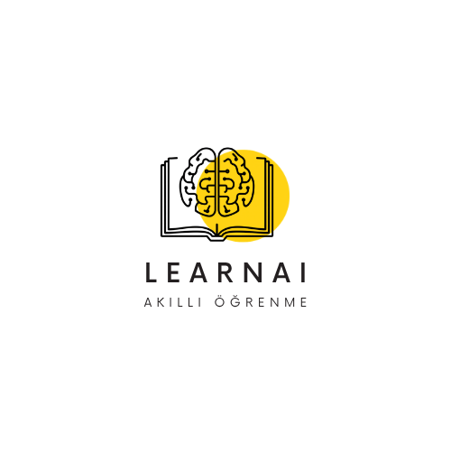
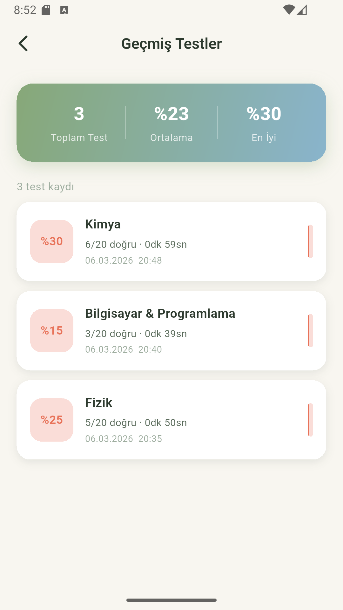
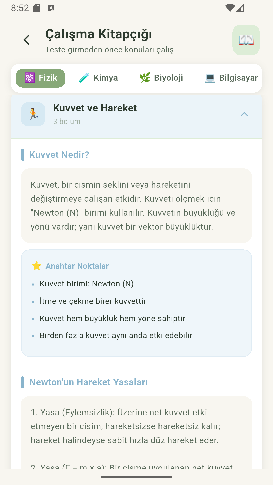
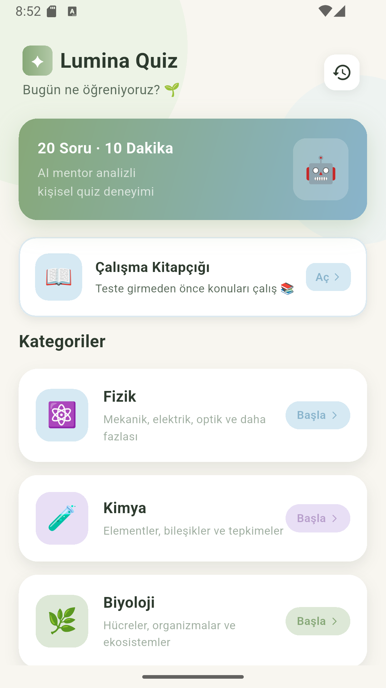

<div align="center">



# Lumina Quiz

**AI destekli, kişiselleştirilmiş quiz uygulaması**

</div>

---

## 📌 Problem

Ortaokul öğrencileri için mevcut test/tekrar araçları genellikle **statik soru havuzlarına** dayanır: aynı sorular tekrar tekrar karşılarına çıkar, zorluk seviyesi öğrenciye göre uyarlanmaz ve yanlış cevap sonrası **neden yanlış yaptığını anlamalarına** yardımcı olacak bir geri bildirim sunulmaz.

**Lumina Quiz**, bu boşluğu Claude AI ile her seferinde **dinamik ve çeşitli** sorular üreterek, test sonunda kişiye özel bir **AI mentor analizi** sunarak ve gamifikasyon (XP, seviye, rozet) ile motivasyonu artırarak kapatmayı hedefler. Tüm sorular Türkiye MEB 5-8. sınıf müfredatına uygun şekilde üretilir.

---

## 🛠️ Teknolojiler

| Katman | Teknoloji |
|--------|-----------|
| Framework | Flutter 3.x / Dart 3.x |
| AI | Anthropic Claude (Messages API) |
| Veritabanı | SQLite (`sqflite`) |
| Yerel Depolama | `shared_preferences` |
| HTTP | `http` |
| Ortam Değişkenleri | `flutter_dotenv` |
| Paylaşım | `share_plus` |
| Cihaz Bilgisi | `device_info_plus` |
| Markdown Render | `flutter_markdown` |

---

## 🚀 Kurulum

### Gereksinimler
- Flutter SDK `>=3.0.0`
- Dart SDK `>=3.0.0`
- Android SDK veya iOS Simulator
- Bir [Anthropic API anahtarı](https://console.anthropic.com/)

### Adımlar

```bash
# 1. Repoyu klonla
git clone https://github.com/batuhanyilmaz1/AI-Destekli-Egitim-Platformu.git
cd AI-Destekli-Egitim-Platformu

# 2. Bağımlılıkları yükle
flutter pub get

# 3. Ortam değişkenlerini ayarla
cp .env.example .env
# .env dosyasını aç ve CLAUDE_API_KEY değerini gir

# 4. Uygulamayı çalıştır
flutter run
```

Release APK oluşturmak için:

```bash
flutter build apk --release
```

> ⚠️ `.env` dosyanızı asla commit etmeyin — `.gitignore` içinde zaten hariç tutulmuştur.

---

## 🌟 Özellikler

<div align="center">



</div>

### 🎯 Quiz Sistemi
- **8 Kategori:** Fizik · Kimya · Biyoloji · Bilgisayar & Programlama · İngilizce · Matematik · Türkçe · Tarih
- **20 Soru** her testte — Claude AI tarafından dinamik ve çeşitli şekilde üretilir, oturum başına tekrar engellenir
- **3 Zorluk Seviyesi:** Kolay (5 dk) · Orta (10 dk) · Zor (14 dk)
- Test duraklatma ve devam etme
- AI çıktısı otomatik doğrulanır, hatalı sorular filtrelenir

### 🤖 AI Mentor
- Test sonunda kişisel performans analizi
- Yanlış soruların nedenleri teşvik edici dille açıklanır

### 🎯 Günlük Görev
- Her gün rastgele bir dersten 5 soruluk mini test, günde bir kez
- Tam puan için +%20 bonus XP

### 🃏 Flashcard & 📖 Çalışma Kitapçığı
- Ders notlarından otomatik üretilen flip kartlar
- AI kullanmadan, hazır konu özetleriyle çalışma imkânı

### 🏆 Gamifikasyon
- **10 Seviye:** Aday → Efsane
- **27 Rozet:** kategori, seri, başarı, günlük görev ve gizli rozetler
- XP sistemi, günlük seri takibi, test geçmişi ve gelişim grafiği

### ✨ Kullanıcı Deneyimi
- Karanlık mod, pastel renk paleti
- Doğru/yanlış cevap animasyonları
- Test sonucu paylaşma

---

## 📄 Lisans

Bu proje [MIT Lisansı](LICENSE) altında lisanslanmıştır.

<div align="center">

**HAYEF Öğrenme Fuarı 2026** için geliştirilmiştir

</div>
